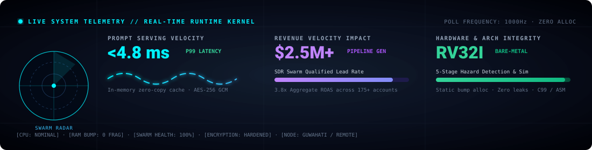
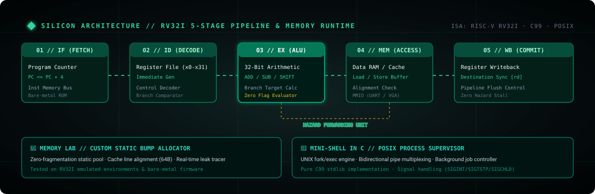
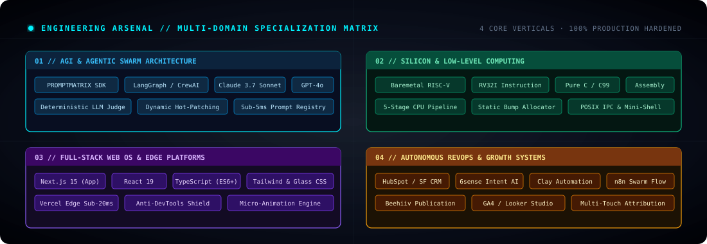
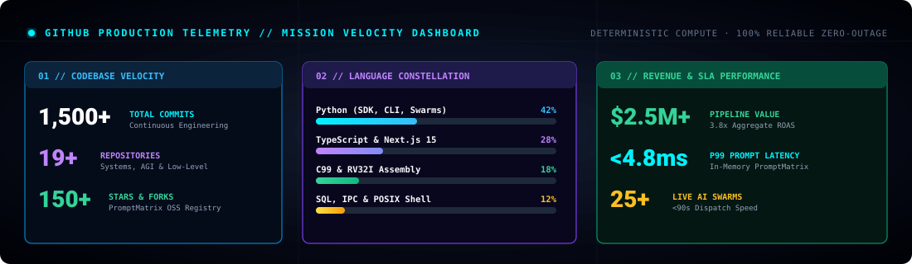
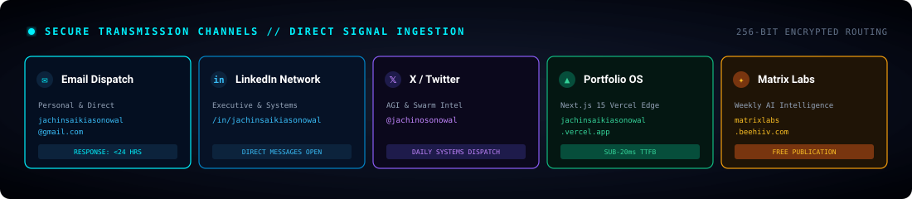

  

  
  
  
  
  

---

  

---

### ⬡ Swarm Control Plane & Multi-Agent Architecture

  

<table>
  <thead>
    <tr>
      <th width="50%"><b>⬡ PROMPTMATRIX — Control Plane &amp; Governance</b></th>
      <th width="50%"><b>🧠 Matrix Labs — Autonomous Growth Infrastructure</b></th>
    </tr>
  </thead>
  <tbody>
    <tr>
      <td valign="top">
        
<b>Runtime prompt behavior registry and sub-5ms evaluation control plane</b> for multi-agent architectures (OpenClaw, LangGraph, CrewAI). Hot-patch drifting agent system prompts live without swarm restart.

        <ul>
          <li>⚡ <b>Sub-5ms Serving:</b> High-throughput in-memory caching &amp; zero-alloc interpolation.</li>
          <li>📦 <b>Zero-Dep Python SDK:</b> <code>pip install promptmatrix</code> (Pure stdlib).</li>
          <li>🛠️ <b>Evaluation CLI:</b> <code>pip install promptmatrix-cli</code> (6D offline evaluation engine).</li>
          <li>🔒 <b>Cryptographic Guardrails:</b> AES-256-GCM encryption &amp; deterministic LLM-as-a-Judge scoring.</li>
        </ul>
        

          <a href="https://promptmatrix.github.io"><b>Explore Official Registry →</b></a> | 
          <a href="https://github.com/PromptMatrix/Promptmatrix"><b>GitHub Source Repository →</b></a>
        

      </td>
      <td valign="top">
        
<b>Autonomous agentic revenue infrastructure</b> deployed across 175+ enterprise and SaaS engagements. Connects intent signal ingestion with multi-agent execution engines.

        <ul>
          <li>🤖 <b>25+ Production AI Swarms:</b> Real-time lead enrichment, intent verification, and SDR routing in &lt;90s.</li>
          <li>📈 <b>$2.5M+ Pipeline Velocity:</b> 3.8x aggregate verified ROAS.</li>
          <li>⚙️ <b>Enterprise MarTech Grid:</b> HubSpot, Salesforce CRM, 6sense, Clay, ActiveCampaign.</li>
          <li>📬 <b>Matrix Labs Intelligence:</b> Weekly publication on AI-native automation &amp; systems.</li>
        </ul>
        

          <a href="https://matrixlabs.beehiiv.com"><b>Subscribe to Newsletter →</b></a> | 
          <a href="https://jachinsaikiasonowal.vercel.app"><b>Launch Portfolio OS →</b></a>
        

      </td>
    </tr>
  </tbody>
</table>

---

### ⚙️ Silicon Architecture & Low-Level Computing Matrix

  

<table>
  <thead>
    <tr>
      <th width="25%"><b>🖥️ Baremetal RISC-V</b></th>
      <th width="25%"><b>🔬 CPU Simulator</b></th>
      <th width="25%"><b>🧪 Memory Lab</b></th>
      <th width="25%"><b>🐚 Mini-Shell in C</b></th>
    </tr>
  </thead>
  <tbody>
    <tr>
      <td valign="top">
        RV32I bootloader, register-level GPIO output, UART drivers, and timer interrupt handlers written in pure C and Assembly.
      </td>
      <td valign="top">
        5-stage pipelined processor simulator with data hazard detection, forwarding paths, branch resolution, and register file tracking.
      </td>
      <td valign="top">
        Zero-fragmentation static bump allocator, 64-byte cache line alignment simulator, and deterministic memory leak tracker.
      </td>
      <td valign="top">
        POSIX UNIX fork-exec engine, bidirectional stream piping, background job supervisor, and signal handler dispatch.
      </td>
    </tr>
  </tbody>
</table>

---

### 🛠️ Technical Constellation & Arsenal Matrix

  

---

### ⚡ System Core Kernel & Telemetry Terminal HUD

  

---

### 📊 Mission Telemetry & Engineering Velocity Dashboard

  

---

### 📡 Secure Signal Transmission & Direct Inquiries

  

  
  
  
  
  

  ⚡ Engineered with deterministic precision &amp; systems architecture by Jachin Saikia Sonowal · Node: Matrix Labs // Assam, India ⚡

