<p align="center">
  <a href="https://jachinsaikiasonowal.vercel.app">
    
  </a>
</p>

<p align="center">
  <a href="https://promptmatrix.github.io">
    
  </a>
  <a href="https://pypi.org/project/promptmatrix">
    
  </a>
  <a href="https://matrixlabs.beehiiv.com">
    
  </a>
  <a href="https://jachinsaikiasonowal.vercel.app">
    
  </a>
  <a href="https://github.com/jachinsaikiasonowal?tab=repositories">
    
  </a>
</p>

---

<p align="center">
  
</p>

---

### 🏛️ The Architectural Manifesto: From Baremetal Silicon to Autonomous Swarms

> *"Systems thinking is the art of mastering boundaries: from the nanosecond clock cycle of an RV32I pipeline, through the zero-alloc runtime of an in-memory prompt cache, to the multi-agent cognitive swarms powering millions in production revenue."*

```text
 ┌─────────────────────────────────────────────────────────────────────────────────────────────────┐
 │                                THE FULL-SPECTRUM COGNITIVE STACK                                │
 ├─────────────────────────┬─────────────────────────┬─────────────────────────────────────────────┤
 │ 01 // SILICON & KERNEL  │ 02 // AGENT CONTROL     │ 03 // AUTONOMOUS REVOPS                     │
 │ RV32I Baremetal · C99   │ PROMPTMATRIX · Hot-Swap │ 25+ Production Multi-Agent Swarms           │
 │ 5-Stage CPU · Bump Mem  │ <5ms Serving · LLM Eval │ $2.5M+ Pipeline Generated · 3.8x ROAS       │
 └─────────────────────────┴─────────────────────────┴─────────────────────────────────────────────┘
```

---

### ⬡ Swarm Control Plane & Multi-Agent Architecture

<p align="center">
  
</p>

<table>
  <thead>
    <tr>
      <th width="50%"><b>⬡ PROMPTMATRIX — Control Plane &amp; Governance</b></th>
      <th width="50%"><b>🧠 Matrix Labs — Autonomous Growth Infrastructure</b></th>
    </tr>
  </thead>
  <tbody>
    <tr>
      <td valign="top">
        <p><b>Runtime prompt behavior registry and sub-5ms evaluation control plane</b> for multi-agent architectures (OpenClaw, LangGraph, CrewAI). Hot-patch drifting agent system prompts live without swarm restart.</p>
        <ul>
          <li>⚡ <b>Sub-5ms Serving:</b> High-throughput in-memory caching & zero-alloc interpolation.</li>
          <li>📦 <b>Zero-Dep Python SDK:</b> <code>pip install promptmatrix</code> (Pure stdlib).</li>
          <li>🛠️ <b>Evaluation CLI:</b> <code>pip install promptmatrix-cli</code> (6D offline evaluation engine).</li>
          <li>🔒 <b>Cryptographic Guardrails:</b> AES-256-GCM encryption & deterministic LLM-as-a-Judge scoring.</li>
        </ul>
        <p>
          <a href="https://promptmatrix.github.io"><b>Explore Official Registry →</b></a> | 
          <a href="https://github.com/PromptMatrix/Promptmatrix"><b>GitHub Source Repository →</b></a>
        </p>
      </td>
      <td valign="top">
        <p><b>Autonomous agentic revenue infrastructure</b> deployed across 175+ enterprise and SaaS engagements. Connects intent signal ingestion with multi-agent execution engines.</p>
        <ul>
          <li>🤖 <b>25+ Production AI Swarms:</b> Real-time lead enrichment, intent verification, and SDR routing in &lt;90s.</li>
          <li>📈 <b>$2.5M+ Pipeline Velocity:</b> 3.8x aggregate verified ROAS.</li>
          <li>⚙️ <b>Enterprise MarTech Grid:</b> HubSpot, Salesforce CRM, 6sense, Clay, ActiveCampaign.</li>
          <li>📬 <b>Matrix Labs Intelligence:</b> Weekly publication on AI-native automation & systems.</li>
        </ul>
        <p>
          <a href="https://matrixlabs.beehiiv.com"><b>Subscribe to Newsletter →</b></a> | 
          <a href="https://jachinsaikiasonowal.vercel.app"><b>Launch Portfolio OS →</b></a>
        </p>
      </td>
    </tr>
  </tbody>
</table>

---

### ⚙️ Silicon Architecture & Low-Level Computing Matrix

<p align="center">
  
</p>

<table>
  <thead>
    <tr>
      <th width="25%"><b>🖥️ Baremetal RISC-V</b></th>
      <th width="25%"><b>🔬 CPU Simulator</b></th>
      <th width="25%"><b>🧪 Memory Lab</b></th>
      <th width="25%"><b>🐚 Mini-Shell in C</b></th>
    </tr>
  </thead>
  <tbody>
    <tr>
      <td valign="top">
        RV32I bootloader, register-level GPIO output, UART drivers, and timer interrupt handlers written in pure C and Assembly.
      </td>
      <td valign="top">
        5-stage pipelined processor simulator with data hazard detection, forwarding paths, branch resolution, and register file tracking.
      </td>
      <td valign="top">
        Zero-fragmentation static bump allocator, 64-byte cache line alignment simulator, and deterministic memory leak tracker.
      </td>
      <td valign="top">
        POSIX UNIX fork-exec engine, bidirectional stream piping, background job supervisor, and signal handler dispatch.
      </td>
    </tr>
  </tbody>
</table>

---

### 🛠️ Technical Constellation & Arsenal Matrix

<p align="center">
  
</p>

---

### ⚡ Interactive Terminal HUD & Field Telemetry

```text
          ;v0%QE#bwf?;                 jachin@matrix-control ---------------------------------------------
       vbQ888g88g8gQ&Efl               . Host: .................. Matrix Labs (Assam, India · Global Remote)
      p888888M88888Mg%MW>              . Kernel: ................ Cognitive Architect & AGI Systems Lead
     i88888888888888888gM:             . Uptime: ................ 8+ Years Production (Revenue & Core Systems)
    <M888ggg88888%E@s88g8j             . Target Architecture: ... RV32I · x86_64 · LLMOps · Vercel Edge
    W88H`  .---..---.  `X88p           . Toolchain: ............. GCC, Make, GDB, Node 22, Python 3.12, Cursor
   .88b` /{{]99  99[}}\ `q8X       
    EMu [-( 89 == 89 )-] !8t           . Stack.Languages: ....... Python, TypeScript, JavaScript, C99, Assembly, SQL
    qMj \_(`00 == 00`)_/ <M:           . Stack.AI & Swarms: ..... PROMPTMATRIX, Claude 3.7, Gemini 2.5, LangGraph
    !Wm`   `"      "`   :O             . Stack.Silicon & Low: ... RISC-V RV32I, POSIX IPC, Static Bump Memory
    cbp`     |    |     lz"            . Stack.Web & Cloud: ..... Next.js 15, React 19, Tailwind, Vercel Edge, Docker
   fEnX      |/\  |     !?u.       
   c8j-    .wWW##WWw.   jx             . Enterprise.RevOps: ..... HubSpot, Salesforce, 6sense, Clay, Beehiiv
   <spf  _m#BBWWWWBB#m_ :I"            . Performance.SLA: ....... <5ms Prompt Evaluation · <90s Lead Swarm Dispatch
    tH$X  `"wwwwwwww"` ~"          
     :&$bv   `====`  ,:~>              - Production Impact & Verification --------------------------------
      OWHqr   `..`   .`,>^             . Revenue Velocity: ...... $2.5M+ Pipeline Verified (3.8x ROAS)
      ~%sg88; |  | ;i+                 . Active Swarms: ......... 25+ Production Multi-Agent Nodes
       m88888%||jkk11`|[[              . Repositories: .......... 19+ High-Performance Systems & OSS
       <8g&E&&|||||||||||              . Commits: ............... 1,500+ High-Discipline Commits
     <1p&8M&QQ\kkk%k%k%i`!,[           . Public Packages: ....... promptmatrix, promptmatrix-cli
 cq#g8MK@&8888|||j**```;i[             
 88888M0$$Qg88g00gmp; ,;;j%k           - Direct Transmission Channels ------------------------------------
 gg8888%#B$M88QK0000%kgK!|jj           . Email.Personal: ........ jachinsaikiasonowal@gmail.com
 88888888Qpd#s$X000H00%K(illl          . LinkedIn: .............. linkedin.com/in/jachinsaikiasonowal
 888888888MssEQ&MHXXXXHQgkill          . X / Twitter: ........... x.com/jachinosonowal
 d&QQg8MMg8888888888888gMg8ggQEQbl     . Portfolio: ............. jachinsaikiasonowal.vercel.app
d8Mg888888888888888888888888888%QO     . Publication: ........... matrixlabs.beehiiv.com
8888888888888888888888888888888888     . Registry: .............. promptmatrix.github.io
```

---

### 📊 Mission Telemetry & Engineering Velocity

<p align="center">
  
  
</p>

<p align="center">
  
</p>

---

### 📡 Secure Signal Transmission & Direct Inquiries

<p align="center">
  <a href="mailto:jachinsaikiasonowal@gmail.com">
    
  </a>
  <a href="https://linkedin.com/in/jachinsaikiasonowal">
    
  </a>
  <a href="https://x.com/jachinosonowal">
    
  </a>
  <a href="https://jachinsaikiasonowal.vercel.app">
    
  </a>
  <a href="https://matrixlabs.beehiiv.com">
    
  </a>
</p>

<p align="center">
  <sub>⚡ Engineered with deterministic precision &amp; systems architecture by Jachin Saikia Sonowal · Node: Matrix Labs // Assam, India ⚡</sub>
</p>
